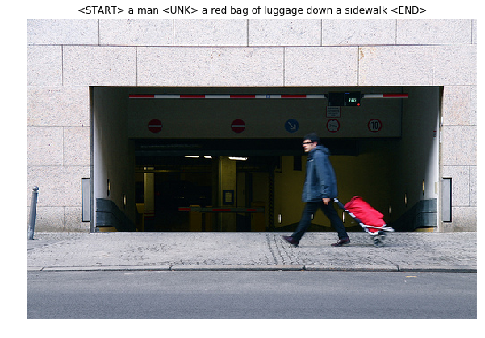

# Image Captioning on Microsoft COCO Dataset

## Description:
A model of Image Captioning using CNN + Vanilla RNN/LSTM on [Microsoft COCO](http://cocodataset.org/#home), which is a standard testbed for image captioning. The goal is to output a caption for a given image. No frameworks are used here. RNN and LSTM are written in pure Numpy and it would also be a good tool for learning the forward and back propagation for RNN and LSTM.

## Package Requirements:
`numpy >= 1.15`

`matplotlib >= 2.2.2`

`h5py == 2.9`

`scipy >= 1.2`

## Dataset:
The dataset consists of 80,000 training images and 40,000 validation images, each annotated with 5 captions written by workers on Amazon Mechanical Turk. The data for this repository can be downloaded [**HERE (Google Drive)**](https://drive.google.com/file/d/1NCbRIJDT12OoNff0wvI6H8gmwWqiIDKO/view) or [**HERE (Drop Box)**](https://www.dropbox.com/s/dngqe90t6owmsov/coco_captioning.zip?dl=0), which is around 1 GB. 

Note that the dataset is not the original COCO dataset, but the preprocessed data with extracted features from the fc7 layer of the VGG-16 network pretrained on ImageNet. The feature files are stored in the files `train2014_vgg16_fc7.h5` and `val2014_vgg16_fc7.h5`. Besides, the dimensionality of the features are cut from 4096 to 512 using [PCA](https://en.wikipedia.org/wiki/Principal_component_analysis), which are stored in the files `train2014_vgg16_fc7_pca.h5` and `val2014_vgg16_fc7_pca.h5`.

Another note is that the images are not downloaded but read from URLs directly from [Flockr](https://www.flickr.com/). The URLs are stored in the files `train2014_urls.txt` and `val2014_urls.txt`. Hence internet is needed for image viewing.

The words in strings of the captions are encoded into integer IDs, and the captions are represented by a sequence of integers. The mapping between integer IDs and words is in the file `coco2014_vocab.json`, and the function `decode_captions` from the file `utils.py` can be used to convert numpy arrays of integer IDs back into strings.

There are a couple special tokens - \<START>, \<END> representing the beginning and end of each caption respectively; \<UNK> representing rare words (small value in bag-of-words model); and \<NULL> after \<END> tokens for padding indicating where no loss or gradient need to be computed.

## Dataset Glimpse:
Below are examples of the dataset which includes an image with a ground-truth caption with <START> and <END> tokens (some with <NULL> tokens).
  

## Model Details:
### Vanilla Recurrent Neural Network (RNN)
Forward pass for each step of Vanilla RNN:

Backward pass of Vanilla RNN can be found in the corresponding [code commend](https://github.com/zhangjh915/Image-Captioning-on-Microsoft-COCO-Dataset/blob/b7bea0c43e9510e85442c74e227cca65203c008a/layers.py#L42-L46).

### Long Short Term Memory (LSTM)
Forward pass for each step of LSTM:

&nbsp;  &nbsp;  &nbsp;  &nbsp;  Input Activation:&nbsp;  &nbsp;  &nbsp;  &nbsp;  &nbsp;  &nbsp;  

&nbsp;  &nbsp;  &nbsp;  &nbsp;  Input Gate: &nbsp;  &nbsp;  &nbsp;  &nbsp;  &nbsp;  &nbsp;  &nbsp;  &nbsp;  &nbsp;  &nbsp;  

&nbsp;  &nbsp;  &nbsp;  &nbsp;  Forget Gate: &nbsp;  &nbsp;  &nbsp;  &nbsp;  &nbsp;  &nbsp;  &nbsp;  &nbsp;  &nbsp;  

&nbsp;  &nbsp;  &nbsp;  &nbsp;  Output Gate:&nbsp;  &nbsp;  &nbsp;  &nbsp;  &nbsp;  &nbsp;  &nbsp;  &nbsp;  &nbsp;  

&nbsp;  &nbsp;  &nbsp;  &nbsp;  Cell State Update:&nbsp;  &nbsp;  &nbsp;  &nbsp;  &nbsp;  

&nbsp;  &nbsp;  &nbsp;  &nbsp;  Next Hidden State: &nbsp;  &nbsp;  &nbsp;  &nbsp;  

Backward pass of LSTMN can be found in the corresponding [code commend](https://github.com/zhangjh915/Image-Captioning-on-Microsoft-COCO-Dataset/blob/2aeb9b7596605a4a161e4b06d485cb1dd1b2fef3/layers.py#L163-L178).

## Model Performance:

To be finished...

## Code Usage:
1. Download the dataset from either Google Drive or Dropbox from the link above and put it in a folder named `data`;
2. Modify `test.py` to train and save the model as well as show the plots of training and validation set.

## References:
1. [https://www.cc.gatech.edu/classes/AY2019/cs7643_fall/hw3/](https://www.cc.gatech.edu/classes/AY2019/cs7643_fall/hw3/)
2. [https://leonardoaraujosantos.gitbooks.io/artificial-inteligence/content/recurrent_neural_networks.html](https://leonardoaraujosantos.gitbooks.io/artificial-inteligence/content/recurrent_neural_networks.html)
3. [https://medium.com/@aidangomez/let-s-do-this-f9b699de31d9](https://medium.com/@aidangomez/let-s-do-this-f9b699de31d9)
4. 
